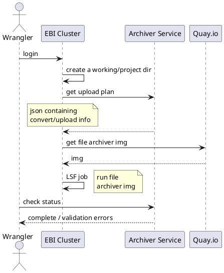
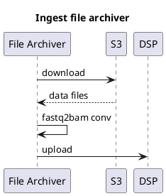

# Data files to EBI Archives

## Current data files archiving flow

- data files are currently uploaded to ENA via DSP.
- it is a manual process that is triggered by a wrangler or dev, and runs on the EBI cluster.
- there are a number of components/envs involved:
    - AWS S3 (where the data files live)
    - DSP (intermediary/broker - via tus-upload endpoint)
    - ENA Archive (where data needs to land, ultimately, in expected format)
    - EBI Cluster (the execution environment)
    - Archiver Service (builds the upload plan)
    - Ingest File Archiver (docker image of file archiving business)

## DSP data files upload

## Ingest file archiver

- executes as part of the above SOP, on the cluster, on a local machine, or the Wrangler EC2 instance.
- does the following:
    - downloads files from S3
    - performs fastq2bam conversion (memory intensive)
    - uploads to DSP via the tus-upload endpoint 
        - the data goes to the DSP staging area in the cluster
        - a process in DSP then moves this data to ENA staging area

## Upload data files to ENA directly

See [3]. 

We need to skip uploading data files to DSP and instead upload directly to ENA staging area in the sra-cluster cluster.

Not needed:

- we do not need bam conversion anymore
    - ENA used to only accept 2 fastq per run (which is not compatible with some tech that HCA uses - 10x mainly)
    - now ENA accepts more files, perhaps not via the Webin-CLI submission route though (https://ena-docs.readthedocs.io/en/latest/submit/reads/webin-cli.html#prepare-the-files )

Requirements to upload to ENA:
- files needs to be gzip compressed
- need to provide .md5 file
    - currently, in hca file metadata, we do not store md5 (we store sha-256, sha-1, CRC-32C and S3 ETag of file) both in the file metadata doc (in mongo) and as S3 tags.
    - we need to calculate the md5, which will be a heavy process for large files

# Proposed Webin user directory structure

<env>/<sub_uuid>

For e.g. 
/dev/xxx-x--xx--xxx

hca-util archive <submission-uuid>

# md5 checksumming
hca does not hold md5 checksums for data files

References:
1. DSP Submission API https://submission.ebi.ac.uk/api (tus-upload)
2. Archiving SOP https://ebi-ait.github.io/hca-ebi-wrangler-central/SOPs/archiving_SOP.html (Step 2 of 3 - Archiving Files to DSP)
3. Upload data files to ENA directly - Product Dev ticket (https://app.zenhub.com/workspaces/dcp-ingest-product-development-5f71ca62a3cb47326bdc1b5c/issues/ebi-ait/dcp-ingest-central/521)